This mobile application is designed for Android version 8.0 and above. 
The main purpose of the application is to allow users to make product exchanges.
The Android Studio IDE and Firebase database were used to create the application.

Libraries used:
- Firebase Authentication
- Firebase Messaging
- Firebase Firestore
- FirebaseCloud Storage
- Picasso
- CircleImageView

Login and password reset view:

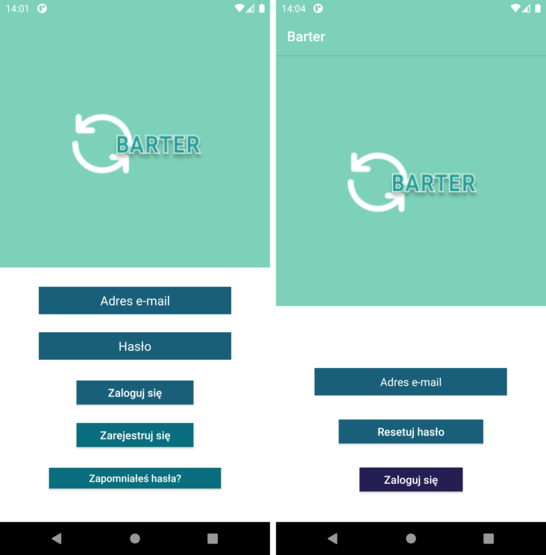

Registration view:

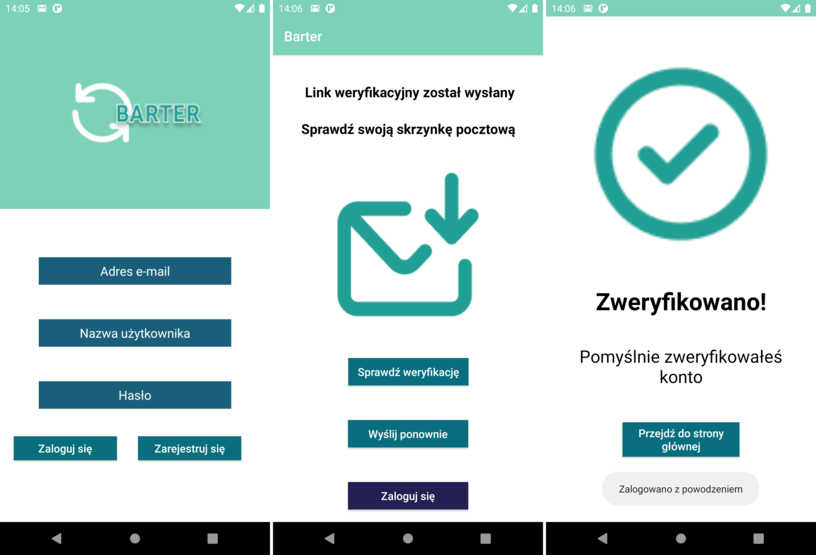

Main menu view:

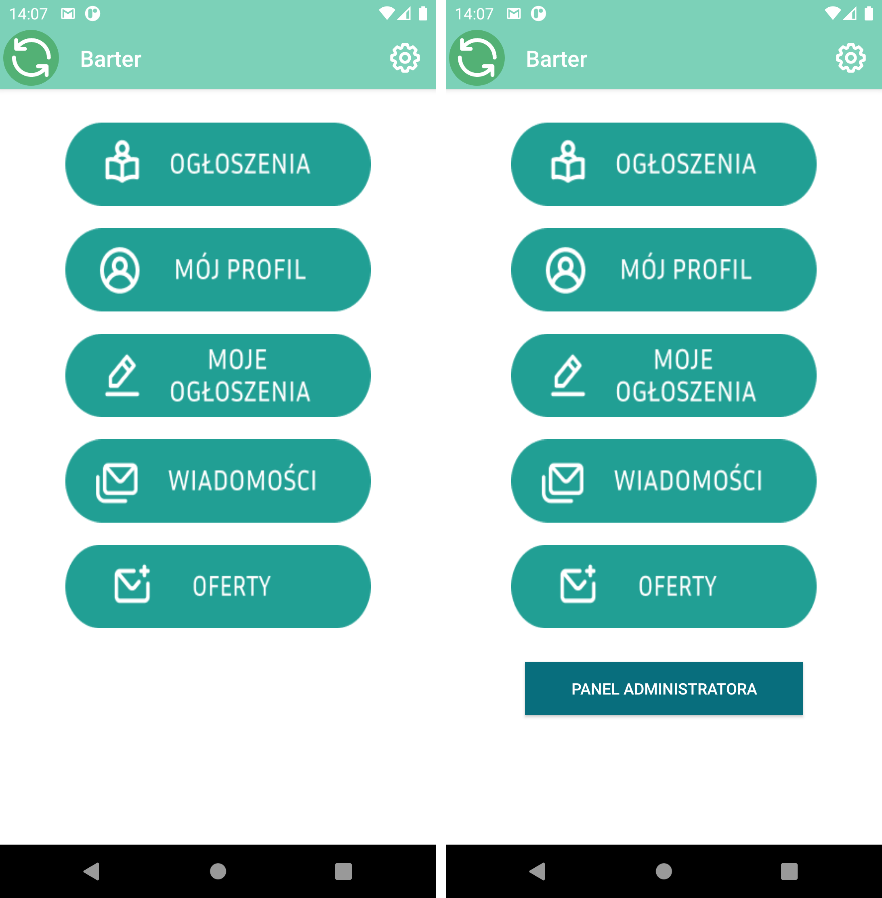

Settings and notification settings view:

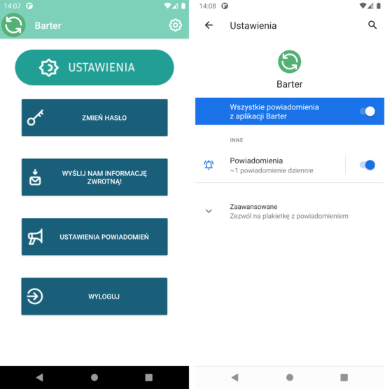

Sending feedback and changing password view:

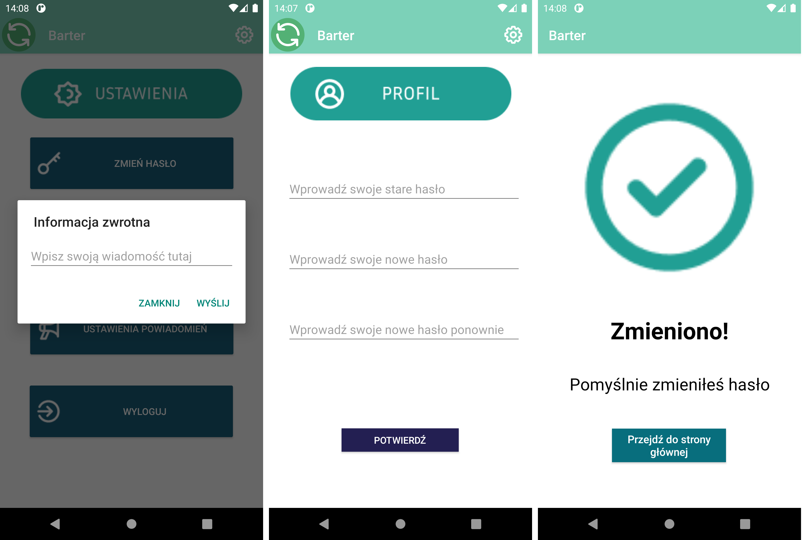

Advertisements, filter and own announcements view:

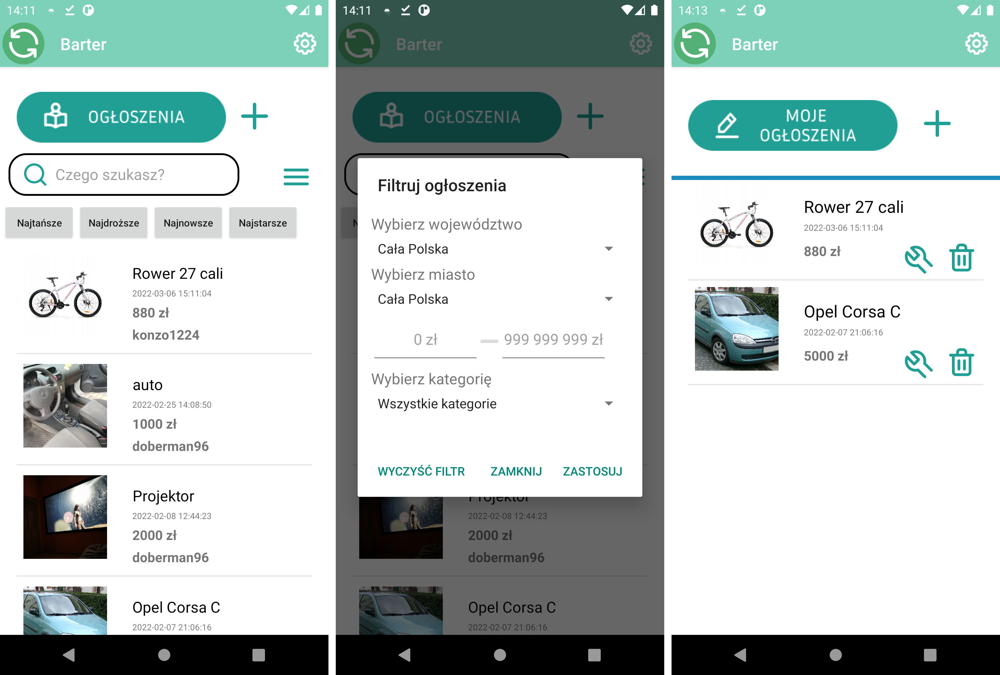

Advertisement page and its addition and editing view:

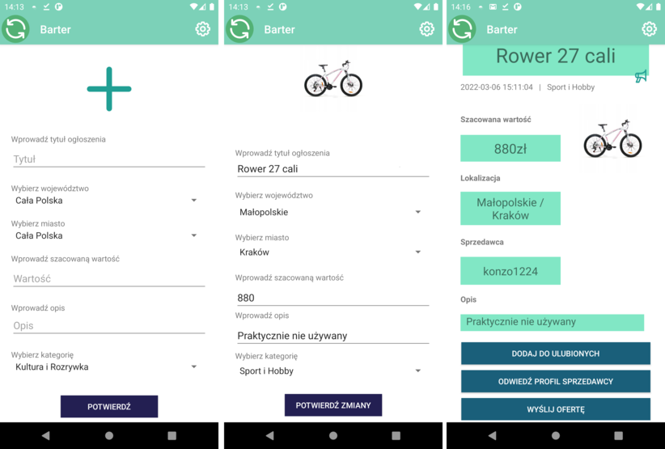

Creating a request and list of requests view:

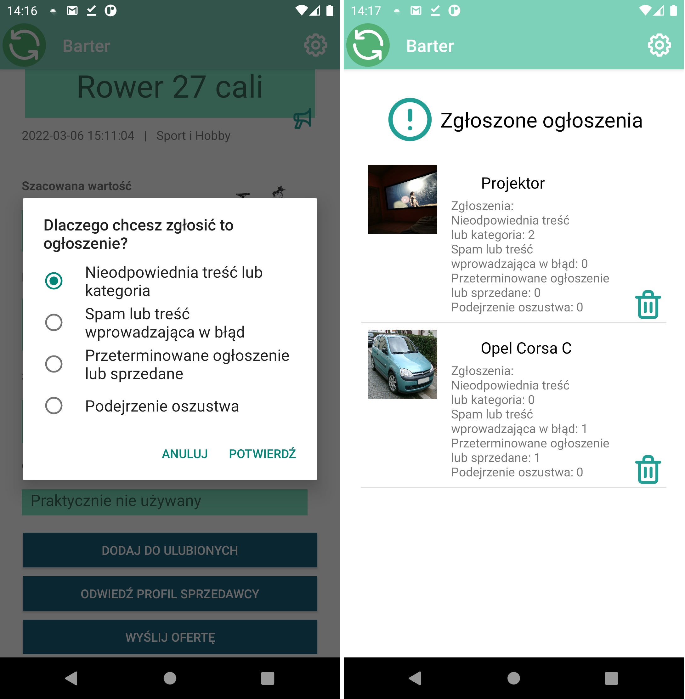

User profile view:

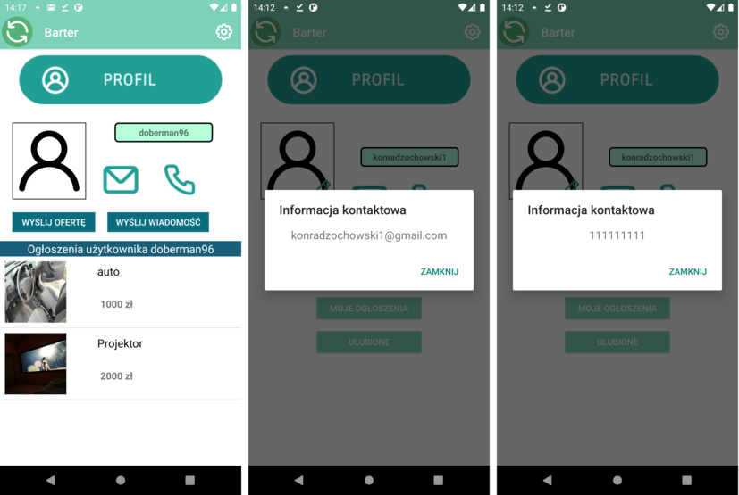

Own profile, edit profile and favorite advertisements view:

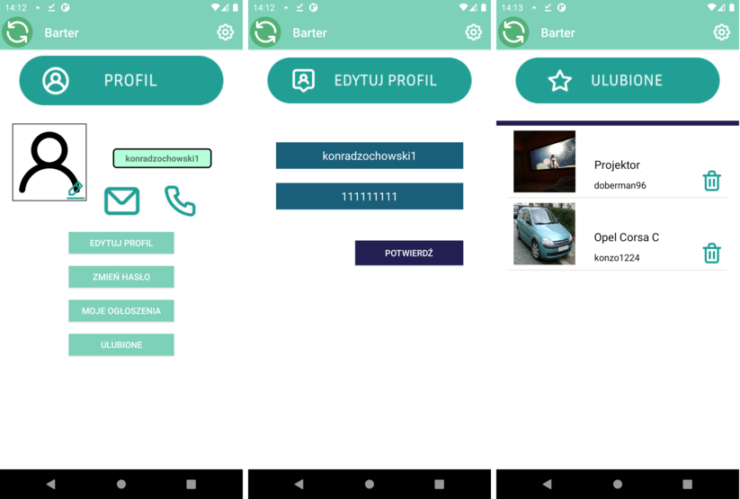

Messages and chat view:

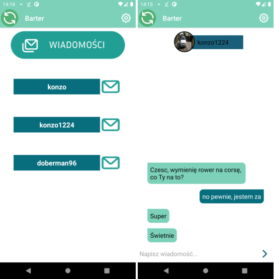

Received and sent offers view:

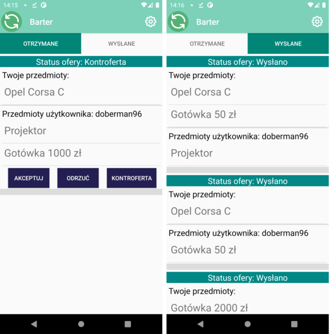

Creating an offer view:

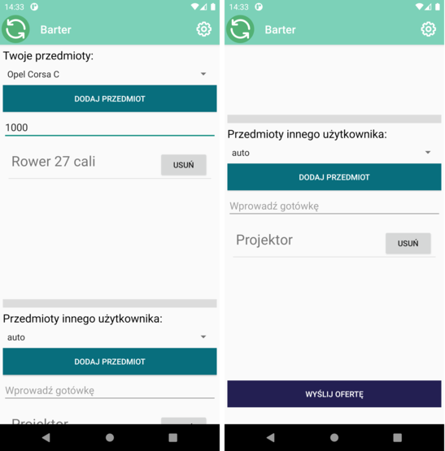

Administration panel, adding categories and list of feedbacks view:

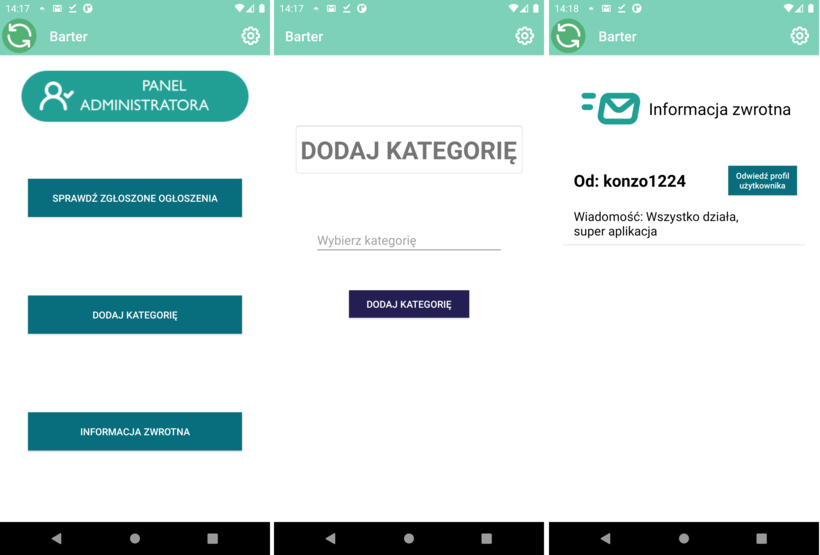
